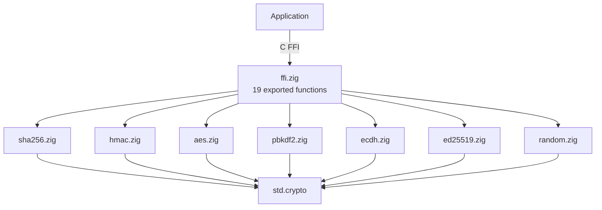

# zig-crypto

Portable cryptographic primitives in Zig with C FFI -- SHA-256, HMAC-SHA-256, AES-CBC, PBKDF2, ECDH P-256, Ed25519, and CSPRNG.

**License:** Zlib OR MIT

## Why

A minimal, zero-dependency crypto library that compiles to a static C library from Zig. No OpenSSL, no CommonCrypto, no system dependencies. Provides the cryptographic primitives needed by CTAP2 PIN protocol, Sparkle update signing, and general-purpose credential management.

## Features

- **SHA-256**: Single-shot and incremental hashing, hex output
- **HMAC-SHA-256**: RFC 4231-conformant message authentication
- **AES-128-CBC / AES-256-CBC**: Encrypt/decrypt with PKCS#7 padding
- **AES-256-CBC raw**: No-padding mode for CTAP2 PIN protocol
- **PBKDF2-SHA1**: RFC 6070-conformant key derivation
- **ECDH P-256**: Key generation and shared secret derivation
- **Ed25519**: Key generation, signing, verification
- **CSPRNG**: OS-backed cryptographically secure random bytes
- **C FFI**: 19 exported functions
- **Property-based tests**: Roundtrip tests for SHA-256, AES, ECDH, Ed25519

## Requirements

- Zig 0.15.2+
- No platform-specific dependencies (pure Zig std.crypto)

## Architecture



## Build

```bash
zig build -Doptimize=ReleaseFast   # static library
zig build test                      # unit tests
zig build test-pbt                  # property-based tests
```

With [just](https://just.systems): `just test-all`, `just build`, `just info`.

## Platform Support

| Platform | Status | Notes |
|----------|--------|-------|
| macOS (arm64/x86_64) | Tested | No frameworks needed |
| Linux (x86_64/arm64) | Supported | No system libraries needed |
| Cross-compilation | Supported | Pure Zig, no platform dependencies |

## C API Reference

Header: [`include/zig_crypto.h`](include/zig_crypto.h). All functions are thread-safe and stateless.

| Function | Returns | Description |
|----------|---------|-------------|
| `zig_crypto_sha256` | void | SHA-256 hash (out: 32 bytes) |
| `zig_crypto_sha256_hex` | size_t (64) | SHA-256 as hex (out: 64 bytes) |
| `zig_crypto_hmac_sha256` | void | HMAC-SHA-256 (out: 32 bytes) |
| `zig_crypto_aes128_cbc_encrypt` | int | AES-128-CBC encrypt, PKCS#7 |
| `zig_crypto_aes128_cbc_decrypt` | int | AES-128-CBC decrypt, PKCS#7 |
| `zig_crypto_aes256_cbc_encrypt` | int | AES-256-CBC encrypt, PKCS#7 |
| `zig_crypto_aes256_cbc_decrypt` | int | AES-256-CBC decrypt, PKCS#7 |
| `zig_crypto_aes256_cbc_encrypt_raw` | int | AES-256-CBC no padding (CTAP2) |
| `zig_crypto_aes256_cbc_decrypt_raw` | int | AES-256-CBC no unpadding (CTAP2) |
| `zig_crypto_pbkdf2_sha1` | void | PBKDF2-HMAC-SHA1 key derivation |
| `zig_crypto_p256_generate` | int (0/-1) | Generate P-256 key pair |
| `zig_crypto_p256_ecdh` | int (0/-1) | ECDH shared secret |
| `zig_crypto_ed25519_generate` | void | Generate Ed25519 key pair |
| `zig_crypto_ed25519_from_seed` | int (0/-1) | Deterministic key from seed |
| `zig_crypto_ed25519_sign` | int (0/-1) | Sign message (sig: 64 bytes) |
| `zig_crypto_ed25519_verify` | bool | Verify signature |
| `zig_crypto_random` | bool | Fill with secure random bytes |

## Integration

```bash
git submodule add https://github.com/Jesssullivan/zig-crypto.git vendor/crypto
cd vendor/crypto && zig build -Doptimize=ReleaseFast
```

Link: `-lzig-crypto`. Include: `#include "zig_crypto.h"`.

## License

Dual-licensed under [Zlib](https://opensource.org/licenses/Zlib) and [MIT](https://opensource.org/licenses/MIT). Choose whichever you prefer.
