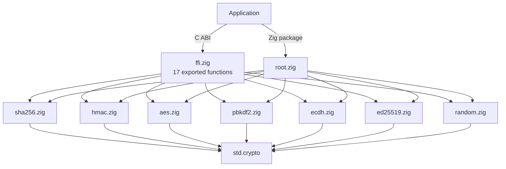

# zig-crypto

Portable cryptographic primitives in Zig with a stable C FFI -- SHA-256, HMAC-SHA-256, AES-CBC, PBKDF2, ECDH P-256, Ed25519, and CSPRNG.

- **License:** Zlib OR MIT
- **Docs:** <https://transscendsurvival.org/zig-crypto/> ([source](docs/)).

## Why

zig-crypto is a small native capability layer for applications that need portable crypto without binding core behavior to one platform's framework surface. It compiles to a static library, exposes a narrow C ABI, and uses Zig's `std.crypto` instead of OpenSSL, CommonCrypto, or other system crypto dependencies.

It is part of the Tinyland Zig Libraries pattern: use Zig to build hermetic native libraries with stable FFI contracts so Swift, C, C++, Zig, Python, GTK, WebKit, or other application layers can call the same primitive surface across macOS and Linux. The goal is portability and auditability: keep app-level developer experience intact while moving framework-bound capabilities behind small, documented native interfaces.

In Tinyland planning, this is the de-attestation direction: app code keeps its presentation and workflow layer while Zig owns the native capability contract. For this repo, the proven scope is crypto. A SwiftUI, Cocoa, UIKit, Objective-C, GTK, WebKit, or CLI app can call `zig_crypto.h` through the same C ABI instead of binding crypto behavior directly to one ecosystem's crypto APIs.

Sibling libraries are related work for keychain storage, desktop notifications, and CTAP2/WebAuthn-style device flows. They follow the same boundary pattern, but each repo should be evaluated on its own implementation, package, and platform support.

## Apple / Swift / Objective-C Parity

zig-crypto does not replace SwiftUI, UIKit, AppKit, or Cocoa application structure. It replaces the crypto capability calls that those apps would otherwise route through Apple-specific frameworks.

| Apple ecosystem surface | zig-crypto surface | Status |
|-------------------------|--------------------|--------|
| CryptoKit `SHA256`, CommonCrypto `CC_SHA256` | `zig_crypto_sha256`, `zig_crypto_sha256_hex` | Available |
| CryptoKit `HMAC<SHA256>`, CommonCrypto `CCHmac` | `zig_crypto_hmac_sha256` | Available |
| CommonCrypto `CCCrypt` / `CCCryptor` AES-CBC with PKCS#7 | AES-128/256-CBC encrypt/decrypt | Available |
| CommonCrypto `CCKeyDerivationPBKDF` PBKDF2-SHA1 workflows | `zig_crypto_pbkdf2_sha1` | Available |
| CryptoKit `P256.KeyAgreement` ECDH primitive | `zig_crypto_p256_generate`, `zig_crypto_p256_ecdh` | Available for the documented CTAP2-style `SHA-256(x-coordinate)` shared secret, not CryptoKit `SharedSecret` / HKDF API parity |
| CryptoKit `Curve25519.Signing` Ed25519-style signing | Ed25519 generate/from-seed/sign/verify | Available through C ABI raw key bytes, not Swift key types |
| Security.framework `SecRandomCopyBytes` | `zig_crypto_random` | Available |

Known Swift/ObjC parity gaps are intentionally small and suitable for first issues:

- Add a SwiftPM/modulemap wrapper and Swift smoke test for importing `zig_crypto.h`.
- Add Objective-C sample code and header annotations for a cleaner ObjC/Swift bridge.
- Add side-by-side CryptoKit/CommonCrypto migration examples for the supported primitives.
- Document non-goals clearly: no Swift `Data` convenience layer, no `NSError` bridge, no CommonCrypto-compatible symbol names, no CryptoKit AES-GCM/HKDF/`SharedSecret`/Swift-key parity, and no Secure Enclave/keychain/notification/AuthenticationServices/CTAP2 transport in this repo.

## Contributing

Contributor work should keep the C ABI stable, preserve the Zig 0.15.2 build path, and avoid adding system crypto dependencies. Start with the [good first issue queue](https://github.com/Jesssullivan/zig-crypto/labels/good%20first%20issue), especially the Swift/Objective-C interop gaps called out in the [Apple interop guide](docs/guides/apple-interop.md).

Before opening a change, run the focused validation commands from [CONTRIBUTING.md](CONTRIBUTING.md). For larger API or packaging changes, open an issue first so the C ABI, Zig package API, and documentation impact can be scoped together.

## Features

- **SHA-256**: Single-shot and incremental hashing, hex output
- **HMAC-SHA-256**: RFC 4231-conformant message authentication
- **AES-128-CBC / AES-256-CBC**: Encrypt/decrypt with PKCS#7 padding
- **AES-256-CBC raw**: No-padding mode for CTAP2 PIN protocol
- **PBKDF2-SHA1**: RFC 6070-conformant key derivation
- **ECDH P-256**: Key generation and shared secret derivation
- **Ed25519**: Key generation, signing, verification
- **CSPRNG**: OS-backed cryptographically secure random bytes
- **C FFI**: 17 exported functions
- **Zig package API**: `src/root.zig` exposes the primitive modules for Zig consumers
- **Property-based tests**: Roundtrip tests for SHA-256, AES, ECDH, Ed25519

## Installation

### Zig Package Manager (recommended)

```bash
zig fetch --save git+https://github.com/Jesssullivan/zig-crypto.git
```

Then in your `build.zig`:

```zig
const dep = b.dependency("zig_crypto", .{ .target = target, .optimize = optimize });
exe.root_module.addImport("zig-crypto", dep.module("zig-crypto"));
```

### Git Submodule (C FFI consumers)

```bash
git submodule add https://github.com/Jesssullivan/zig-crypto.git vendor/crypto
cd vendor/crypto && zig build -Doptimize=ReleaseFast
```

Link `-lzig-crypto` and include `#include "zig_crypto.h"`.

## Requirements

- Zig 0.15.2+
- No platform-specific dependencies (pure Zig std.crypto)

## Architecture


```mermaid
graph TD
    A[Application] -->|C ABI| B[ffi.zig<br/>17 exported functions]
    A -->|Zig package| R[root.zig]
    B --> C[sha256.zig]
    B --> D[hmac.zig]
    B --> E[aes.zig]
    B --> F[pbkdf2.zig]
    B --> G[ecdh.zig]
    B --> H[ed25519.zig]
    B --> I[random.zig]
    R --> C
    R --> D
    R --> E
    R --> F
    R --> G
    R --> H
    R --> I
    C --> Z[std.crypto]
    D --> Z
    E --> Z
    F --> Z
    G --> Z
    H --> Z
    I --> Z
```

## Build

```bash
zig build -Doptimize=ReleaseFast   # static library
zig build test                      # unit tests
zig build test-pbt                  # property-based tests
zig build docs                      # generate API documentation
zig build example                   # build and run C example
```

With [just](https://just.systems): `just test-all`, `just build`, `just info`.

## Platform Support

| Platform | Status | Notes |
|----------|--------|-------|
| macOS | Supported | No frameworks needed |
| Linux | Supported | No system crypto libraries needed |
| Cross-compilation | Supported | Pure Zig, no platform dependencies |

## Tinyland Zig Libraries

The library family targets small native surfaces that are often tangled with platform frameworks or entitlement/provisioning flows. `zig-crypto` is the crypto proof in that pattern; sibling libraries are related work with their own implementation and platform-support status.

| Library | Surface | Current role |
|---------|---------|--------------|
| `zig-crypto` | Crypto primitives | Pure Zig static library and C ABI for hashes, MACs, AES, PBKDF2, P-256, Ed25519, and CSPRNG |
| `zig-keychain` | Secret storage | Related boundary target for keychain/secret storage portability |
| `zig-notify` | Desktop notifications | Related boundary target for notification portability |
| `zig-ctap2` | FIDO2/WebAuthn device flows | Related boundary target for CTAP2 HID and PIN protocol flows |

Each library should stay small enough to audit, package, and link independently.

## C API Reference

Header: [`include/zig_crypto.h`](include/zig_crypto.h). All functions are thread-safe and stateless.

| Function | Returns | Description |
|----------|---------|-------------|
| `zig_crypto_sha256` | void | SHA-256 hash (out: 32 bytes) |
| `zig_crypto_sha256_hex` | size_t (64) | SHA-256 as hex (out: 64 bytes) |
| `zig_crypto_hmac_sha256` | void | HMAC-SHA-256 (out: 32 bytes) |
| `zig_crypto_aes128_cbc_encrypt` | int | AES-128-CBC encrypt, PKCS#7 |
| `zig_crypto_aes128_cbc_decrypt` | int | AES-128-CBC decrypt, PKCS#7 |
| `zig_crypto_aes256_cbc_encrypt` | int | AES-256-CBC encrypt, PKCS#7 |
| `zig_crypto_aes256_cbc_decrypt` | int | AES-256-CBC decrypt, PKCS#7 |
| `zig_crypto_aes256_cbc_encrypt_raw` | int | AES-256-CBC no padding (CTAP2) |
| `zig_crypto_aes256_cbc_decrypt_raw` | int | AES-256-CBC no unpadding (CTAP2) |
| `zig_crypto_pbkdf2_sha1` | void | PBKDF2-HMAC-SHA1 key derivation |
| `zig_crypto_p256_generate` | int (0/-1) | Generate P-256 key pair |
| `zig_crypto_p256_ecdh` | int (0/-1) | ECDH shared secret |
| `zig_crypto_ed25519_generate` | void | Generate Ed25519 key pair |
| `zig_crypto_ed25519_from_seed` | int (0/-1) | Deterministic key from seed |
| `zig_crypto_ed25519_sign` | int (0/-1) | Sign message (sig: 64 bytes) |
| `zig_crypto_ed25519_verify` | bool | Verify signature |
| `zig_crypto_random` | bool | Fill with secure random bytes |

## Integration

```bash
git submodule add https://github.com/Jesssullivan/zig-crypto.git vendor/crypto
cd vendor/crypto && zig build -Doptimize=ReleaseFast
```

Link: `-lzig-crypto`. Include: `#include "zig_crypto.h"`.

## License

Dual-licensed under [Zlib](https://opensource.org/licenses/Zlib) and [MIT](https://opensource.org/licenses/MIT). Choose whichever you prefer.
