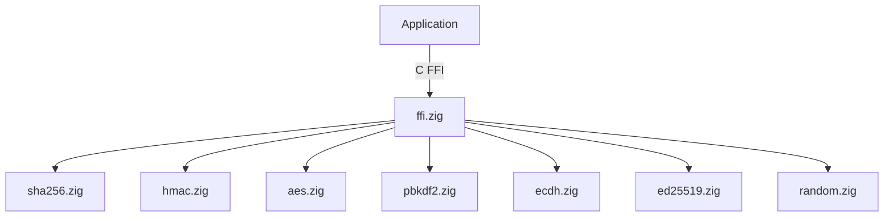

# zig-crypto

Portable cryptographic primitives in Zig -- SHA-256, HMAC, AES-CBC, ECDH P-256, Ed25519, PBKDF2, and CSPRNG with a C FFI.

**License:** Zlib OR MIT

## Features

- **SHA-256**: Hash and hex-string output
- **HMAC-SHA-256**: Keyed message authentication
- **AES-128/256-CBC**: Encrypt/decrypt with PKCS#7 padding and raw (no-padding) variants
- **PBKDF2-SHA1**: Key derivation
- **ECDH P-256**: Ephemeral key generation and shared secret derivation
- **Ed25519**: Key generation, signing, and verification
- **CSPRNG**: Cryptographically secure random bytes
- **C FFI**: All primitives exported for Swift, C, C++ interop

## Quick Start

```bash
# Build static library
zig build -Doptimize=ReleaseFast

# Run tests
zig build test
zig build test-pbt
```

## Architecture



## Source Tree

```
zig-crypto/
  build.zig           -- Build configuration
  include/
    zig_crypto.h       -- C header (public API)
  src/
    ffi.zig            -- C FFI exports
    sha256.zig         -- SHA-256 hash
    hmac.zig           -- HMAC-SHA-256
    aes.zig            -- AES-128/256-CBC
    pbkdf2.zig         -- PBKDF2-SHA1
    ecdh.zig           -- ECDH P-256
    ed25519.zig        -- Ed25519 signatures
    random.zig         -- CSPRNG
  tests/               -- Property-based tests
```

## Requirements

- Zig 0.15.2+
- macOS or Linux
