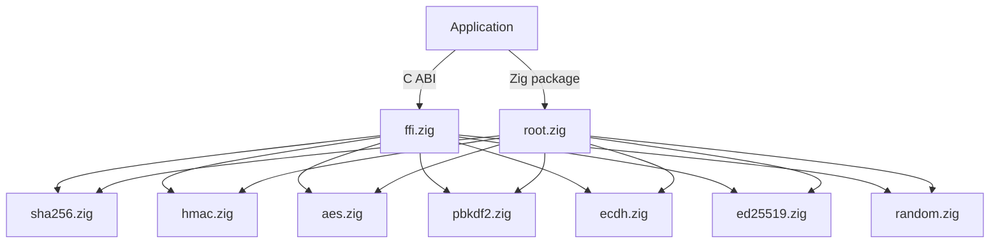

# zig-crypto

Portable cryptographic primitives in Zig with a stable C FFI -- SHA-256, HMAC, AES-CBC, ECDH P-256, Ed25519, PBKDF2, and CSPRNG.

**License:** Zlib OR MIT

## Purpose

zig-crypto is a hermetic native capability layer for applications that need portable crypto without binding core behavior to one platform's crypto framework. It builds a static library from Zig, exposes 17 C ABI functions, and also provides a Zig package root for direct Zig consumers.

The stable boundary is the C ABI: application code can keep its SwiftUI, Cocoa, UIKit, Objective-C, GTK, WebKit, CLI, or Zig-facing developer experience while crypto behavior moves into a small implementation that can be built, tested, and linked on macOS or Linux.

In Tinyland planning, that boundary is part of the de-attestation effort: move native capability contracts out of ecosystem-specific framework assumptions and into portable, auditable Zig libraries. For `zig-crypto`, the concrete Apple analogs are CryptoKit SHA/HMAC/P-256/Curve25519.Signing primitives.

CommonCrypto AES-CBC/PBKDF2-era calls and Security.framework random bytes are separate analogs. Sibling libraries for keychain storage, desktop notifications, and CTAP2/WebAuthn-style device flows carry their own implementation and platform-support status.

See the [Apple interop guide](guides/apple-interop.md) for what is available today, what is not yet Swift/ObjC parity, and which gaps are good first issues.

## Features

- **SHA-256**: Hash and hex-string output
- **HMAC-SHA-256**: Keyed message authentication
- **AES-128/256-CBC**: Encrypt/decrypt with PKCS#7 padding and raw (no-padding) variants
- **PBKDF2-SHA1**: Key derivation
- **ECDH P-256**: Ephemeral key generation and shared secret derivation
- **Ed25519**: Key generation, signing, and verification
- **CSPRNG**: Cryptographically secure random bytes
- **C FFI**: 17 exported functions for Swift, C, C++ interop
- **Zig API**: `src/root.zig` exposes primitive modules for Zig consumers

## Quick Start

```bash
# Build static library
zig build -Doptimize=ReleaseFast

# Run tests
zig build test
zig build test-pbt

# Build and run the C example
zig build example
```

## Architecture


```mermaid
graph TD
    A[Application] -->|C ABI| B[ffi.zig]
    A -->|Zig package| R[root.zig]
    B --> C[sha256.zig]
    B --> D[hmac.zig]
    B --> E[aes.zig]
    B --> F[pbkdf2.zig]
    B --> G[ecdh.zig]
    B --> H[ed25519.zig]
    B --> I[random.zig]
    R --> C
    R --> D
    R --> E
    R --> F
    R --> G
    R --> H
    R --> I
```

## Source Tree

```
zig-crypto/
  build.zig           -- Build configuration
  include/
    zig_crypto.h       -- C header (public API)
  src/
    root.zig           -- Zig package API root
    ffi.zig            -- C FFI exports
    sha256.zig         -- SHA-256 hash
    hmac.zig           -- HMAC-SHA-256
    aes.zig            -- AES-128/256-CBC
    pbkdf2.zig         -- PBKDF2-SHA1
    ecdh.zig           -- ECDH P-256
    ed25519.zig        -- Ed25519 signatures
    random.zig         -- CSPRNG
  tests/               -- Property-based tests
```

## Requirements

- Zig 0.15.2+
- macOS or Linux
